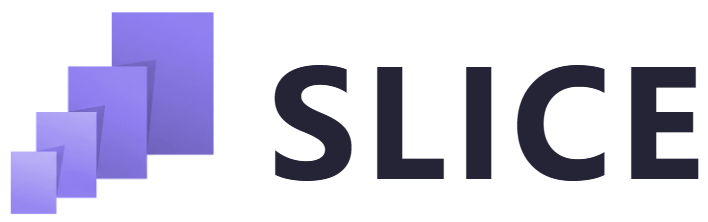

  

<h2 align="center">Scalable LiDAR Image Coding with Embedded Refinement</h2>

  Kang You1,†,
  Jiahao Zhu1,†,
  Dandan Ding2,
  M. Salman Asif3,
  Zhan Ma1,*

  1 Nanjing University &nbsp;
  2 Hangzhou Normal University &nbsp;
  3 University of California, Riverside
   
  † Equal contribution &nbsp;·&nbsp; * Corresponding author

  

## News

- **2026-09-28:** We released the [SLICE project website](https://njuvision.github.io/SLICE/)!
